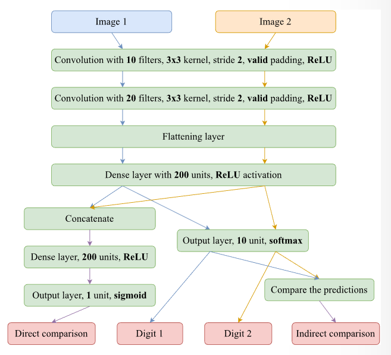

# MNIST Multiple Inputs and Outputs Assignment

This project implements a multi-input, multi-output model for MNIST, where the task is to determine if the digit in one image is greater than the digit in a second image. The model performs both direct and indirect comparisons of the two digits and uses separate outputs for each task.

## Table of Contents
- [Assignment Overview](#assignment-overview)
- [Solution Explanation](#solution-explanation)
- [Usage](#usage)
- [File Structure](#file-structure)

---

## Assignment Overview

The objective of this assignment is to:
1. **Train a Multi-Input, Multi-Output Model**:
    - The model takes two MNIST images as inputs and has four outputs:
        - **Direct Comparison**: Predicts if the digit in the first image is greater than the digit in the second.
        - **Digit Classification**: Classifies the digit in each image independently.
        - **Indirect Comparison**: Predicts the comparison result based on classified digits from both images.
2. **Dataset Creation**:
    - The dataset consists of pairs of MNIST images, where each pair is labeled for direct comparison (whether the first digit is greater than the second).




**Supported Outputs**:
- **Direct Comparison**: Binary output indicating if the first digit is greater.
- **Digit 1 Classification**: Classification output for the digit in the first image.
- **Digit 2 Classification**: Classification output for the digit in the second image.
- **Indirect Comparison**: Comparison output based on digit classifications.

**Example Command**:
```bash
python3 mnist_multiple.py --epochs=1 --batch_size=50
```

## Solution Explanation

The solution (`mnist_multiple.py`) includes:
1. **Model Architecture**:
    - The model accepts two MNIST images as inputs, processing them through a shared CNN subnetwork that includes:
        - Rescaling and convolutional layers.
        - A dense layer to create embeddings for comparison.
    - **Direct Comparison**: Combines the embeddings from both images to determine which digit is greater.
    - **Indirect Comparison**: Classifies each image independently, then performs a comparison based on the classification results.
2. **Loss Functions and Metrics**:
    - The model uses separate losses and metrics for each output:
        - **Binary Cross-Entropy** for the direct comparison output.
        - **Sparse Categorical Cross-Entropy** for digit classifications.
        - **Binary Accuracy** for both comparison tasks.
3. **Dataset Generation**:
    - The `create_dataset` function constructs pairs of images and labels for both comparison tasks using the original MNIST data, ensuring the dataset aligns with the model’s multiple outputs.

## Usage

To train the model with a specific batch size and number of epochs, use the following command:

### Basic Training Command
```bash
python3 mnist_multiple.py --epochs=<number_of_epochs> --batch_size=<batch_size>
```

Example:
```bash
python3 mnist_multiple.py --epochs=1 --batch_size=50
```

### Example Output
With `--epochs=1` and `--batch_size=50`, an example output might look like:
```
direct_comparison_accuracy: 0.7993 - indirect_comparison_accuracy: 0.8930 - loss: 1.6710 - val_direct_comparison_accuracy: 0.9508 - val_indirect_comparison_accuracy: 0.9836 - val_loss: 0.2984
```

## File Structure

The project directory contains the following files:

```
.
├── figures                   # Figures and visualizations.
├── mnist_multiple.py         # Main script for multi-input, multi-output model on MNIST.
├── mnist.py                  # Utility script for loading and batching MNIST data.
└── README.md                 # Project documentation.
```

Refer to individual file comments and code documentation for further details.